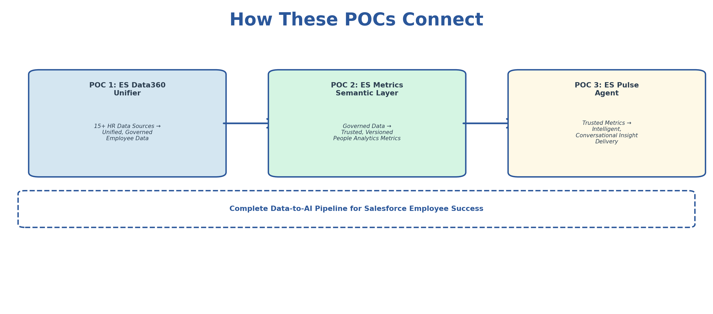

# Data & AI Solutions for Salesforce Employee Success

**Three production-ready POC designs addressing critical data engineering and AI challenges for Salesforce's Employee Success (ES) People Analytics team.**

[**View the Live Portfolio**](https://sqlicious.github.io/salesforce-es-data-ai-poc-portfolio/)

---

## The Problem

Salesforce's ES team manages employee data across 15+ HR systems, struggles with inconsistent metric definitions, and needs agentic AI to move from static reporting to conversational, proactive insight delivery.

## The Solution — Three Connected POCs

| POC | What It Solves | Key Pattern |
|-----|---------------|-------------|
| **ES Data360 Unifier** | Siloed HR data, PII governance overhead, identity resolution | Metadata-driven integration with automated governance |
| **ES Metrics Semantic Layer** | Conflicting metric definitions, reporting bottleneck | Centralized, versioned metric engine with lineage tracking |
| **ES Pulse Agent** | Static reports, no proactive alerting, unused unstructured data | Agentic RAG with adaptive reasoning and guardrails |

Together they form a complete **data-to-AI pipeline**: integrate the data &rarr; define trusted metrics &rarr; deliver intelligent insights.

## Architecture

Each POC includes detailed architecture diagrams, technical approach with code samples, Salesforce platform mapping, phased implementation roadmaps, and expected impact metrics.

*Prepared by [Roopmathi (Ruby) Gunna](https://www.linkedin.com/in/roopmathi-gunna/) — Senior Data Engineer specializing in enterprise data platforms and agentic AI.*
